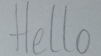

# Handwritten Text Recognition with TensorFlow

* **Update 2021: more robust model, faster dataloader, word beam search decoder also available for Windows**
* **Update 2020: code is compatible with TF2**


Handwritten Text Recognition (HTR) system implemented with TensorFlow (TF) and trained on the IAM off-line HTR dataset.
This Neural Network (NN) model recognizes the text contained in the images of segmented words as shown in the illustration below.
3/4 of the words from the validation-set are correctly recognized, and the character error rate is around 10%.


## Run demo
[Download the model](https://www.dropbox.com/s/lod3gabgtuj0zzn/model.zip?dl=1) trained on the IAM dataset.
Put the contents of the downloaded file `model.zip` into the `model` directory of the repository.
Afterwards, go to the `src` directory and run `python main.py`.
The input image and the expected output is shown below.



```
> python main.py
Init with stored values from ../model/snapshot-39
Recognized: "Hello"
Probability: 0.42098119854927063
```


## Command line arguments
* `--train`: train the NN on 95% of the dataset samples and validate on the remaining 5%
* `--validate`: validate the trained NN
* `--batch_size`: batch size
* `--data_dir`: directory containing IAM dataset (with subdirectories `img` and `gt`)
* `--dump`: dumps the output of the NN to CSV file(s) saved in the `dump` folder.

If neither `--train` nor `--validate` is specified, the NN infers the text from the test image (`data/test.png`).


## Train model with IAM dataset

Follow these instructions to get the IAM dataset:

* Register for free at this [website](http://www.fki.inf.unibe.ch/databases/iam-handwriting-database)
* Download `words/words.tgz`
* Download `ascii/words.txt`
* Create a directory for the dataset on your disk, and create two subdirectories: `img` and `gt`
* Put `words.txt` into the `gt` directory
* Put the content (directories `a01`, `a02`, ...) of `words.tgz` into the `img` directory

### Start the training

* Delete files from `model` directory if you want to train from scratch
* Go to the `src` directory and execute `python main.py --train --data_dir path/to/IAM`
* Training stops after a fixed number of epochs without improvement

## Information about model

The model is a stripped-down version of the HTR system I implemented for [my thesis]((https://repositum.tuwien.ac.at/obvutwhs/download/pdf/2874742)).
What remains is what I think is the bare minimum to recognize text with an acceptable accuracy.
It consists of 5 CNN layers, 2 RNN (LSTM) layers and the CTC loss and decoding layer.
The illustration below gives an overview of the NN (green: operations, pink: data flowing through NN) and here follows a short description:

* The input image is a gray-value image and has a size of 128x32
* 5 CNN layers map the input image to a feature sequence of size 32x256
* 2 LSTM layers with 256 units propagate information through the sequence and map the sequence to a matrix of size 32x80. Each matrix-element represents a score for one of the 80 characters at one of the 32 time-steps
* The CTC layer either calculates the loss value given the matrix and the ground-truth text (when training), or it decodes the matrix to the final text with best path decoding or beam search decoding (when inferring)


## References
* [Build a Handwritten Text Recognition System using TensorFlow](https://towardsdatascience.com/2326a3487cd5)
* [Scheidl - Handwritten Text Recognition in Historical Documents](https://repositum.tuwien.ac.at/obvutwhs/download/pdf/2874742)
* [Scheidl - Word Beam Search: A Connectionist Temporal Classification Decoding Algorithm](https://repositum.tuwien.ac.at/obvutwoa/download/pdf/2774578)

